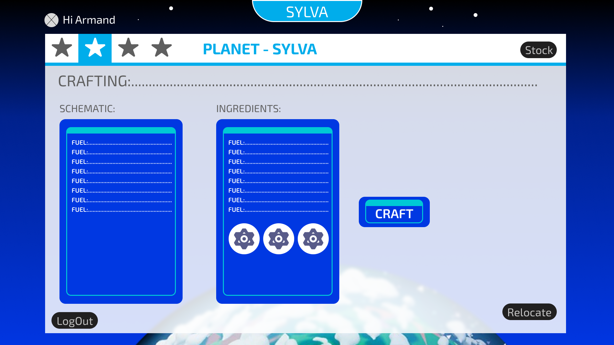
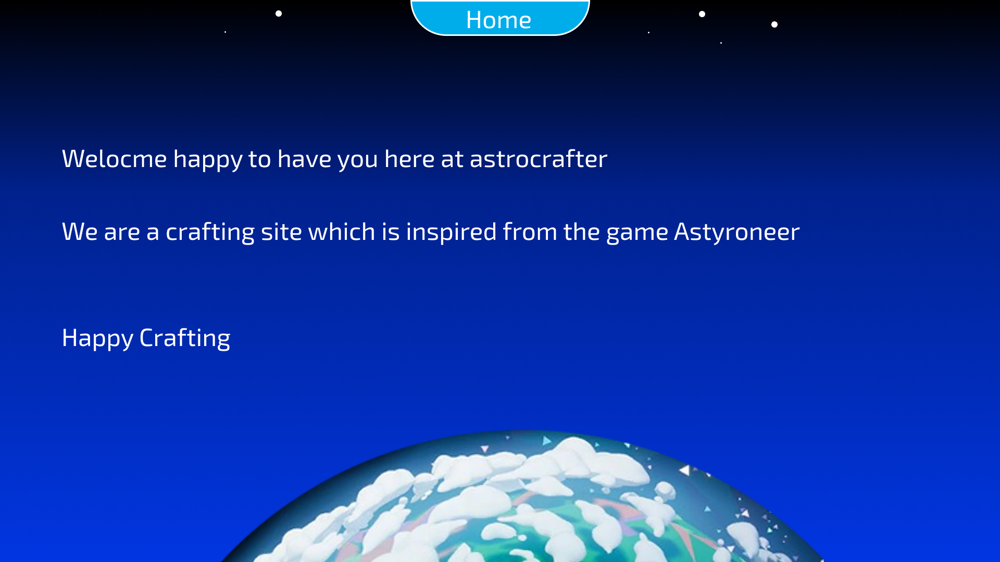
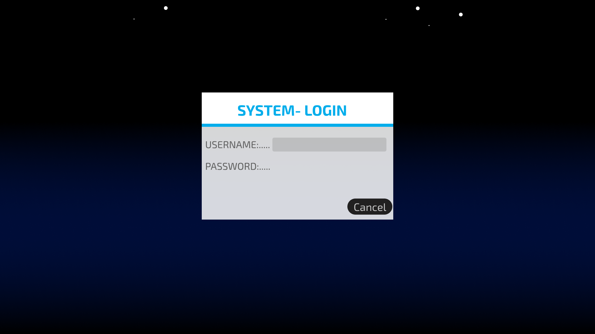

<!-- Repository Information & Links-->
<br />


<!--  -->


<!-- HEADER SECTION -->
<h5 align="center" style="padding:0;margin:0;">Cameron Godwin</h5>
<h5 align="center" style="padding:0;margin:0;">200109</h5>
<h5 align="center" style="padding:0;margin:0;">Tsebo Ramonyalioa</h5>
<h5 align="center" style="padding:0;margin:0;">200200</h5>
<h6 align="center">DV300 - Term 1 | 2024</h6>
</br>
<p align="center">

  <a href="https://github.com/GodwinCameron/AstroCrafter">
    
  </a>
  
  <h3 align="center">AstroCrafter</h3>

  <p align="center">
    A Full Stack Project for crafting items<br>
    
   <br />
   <br />
   <a href="">View Demo</a>
    ·
    <a href="https://github.com/GodwinCameron/AstroCrafter/issues">Report Bug</a>
    ·
    <a href="https://github.com/GodwinCameron/AstroCrafter/issues">Request Feature</a>
</p>
<!-- TABLE OF CONTENTS -->

## Table of Contents

* [About the Project](#about-the-project)
  * [Project Description](#project-description)
  * [Built With](#built-with)
* [Getting Started](#getting-started)
  * [Prerequisites](#prerequisites)
  * [How to install](#how-to-install)
* [Features and Functionality](#features-and-functionality)
* [Concept Process](#concept-process)
   * [Ideation](#ideation)
   * [Wireframes](#wireframes)
   * [Custom UI](#user-flow)
* [Development Process](#development-process)
   * [Implementation Process](#implementation-process)
        * [Highlights](#highlights)
        * [Challenges](#challenges)
   * [Future Implementation](#peer-reviews)
* [Final Outcome](#final-outcome)
    * [Mockups](#mockups)
    * [Video Demonstration](#video-demonstration)
* [Conclusion](#conclusion)
* [License](#license)
* [Contact](#contact)
* [Acknowledgements](#acknowledgements)

<!--PROJECT DESCRIPTION-->


### Project Description

Creating an Angular website for crafting items, this had to be created with the Angular and Typescript. 

### Built With

<!-- 
* [Mongo] (https://www.mongodb.com/)
* [Express] (https://expressjs.com/)
* [React] (https://reactjs.org/)
* [Node] (https://nodejs.org/en) -->
* [Angular] [&nbsp;&nbsp;&nbsp;&nbsp;&nbsp;&nbsp;&nbsp;&nbsp;](https://angular.io/)

* [Typescript] [&nbsp;&nbsp;&nbsp;&nbsp;&nbsp;&nbsp;&nbsp;&nbsp;](https://www.typescriptlang.org/)

* [React] [&nbsp;&nbsp;&nbsp;&nbsp;&nbsp;&nbsp;&nbsp;&nbsp;](https://reactjs.org/)

* [Node] [&nbsp;&nbsp;&nbsp;&nbsp;&nbsp;&nbsp;&nbsp;&nbsp;](https://nodejs.org/en/)

* [PostgreSQL] [&nbsp;&nbsp;&nbsp;&nbsp;&nbsp;&nbsp;&nbsp;&nbsp;](https://www.postgresql.org/)


<!-- GETTING STARTED -->
<!-- Make sure to add appropriate information about what prerequesite technologies the user would need and also the steps to install your project on their own machines -->
## Getting Started

The following instructions will get you a copy of the project up and running on your local machine for development and testing purposes.

### Prerequisites

Ensure that you have the latest version of [NPM](https://www.npmjs.com/) installed on your machine. The [GitHub Desktop](https://desktop.github.com/) program will also be required. 

### How to install

### Installation
Here are a couple of ways to clone this repo:

1. GitHub Desktop </br>
Enter `https://github.com/GodwinCameron/AstroCrafter.git` into the URL field and press the `Clone` button.

2. Clone Repository </br>
Run the following in the command-line to clone the project:
   ```sh
   git clone https://github.com/GodwinCameron/AstroCrafter.git
   ```
    Open `Software` and select `File | Open...` from the menu. Select cloned directory and press `Open` button

3. Install Dependencies </br>
Run the following in the command-line to install all the required dependencies:
   ```sh
   npm install
   ```

<!-- FEATURES AND FUNCTIONALITY-->
<!-- You can add the links to all of your imagery at the bottom of the file as references -->
## Features and Functionality

<!-- note how you can use your gitHub link. Just make a path to your assets folder -->
### Feature 
<!-- Admin Page with CRUD for oil products<br> -->

<!--  <br><br> -->

 <!-- The authentication is displayed in modals (the navy labels). The modals disappear while the user enters their information. <br> -->

<!-- <br><br> -->

 <!-- The logout feature button is on the navigation bar for the user, as this is a security feature that avoids the user being hacked, making our database vulnerable and the user. When the user clicks on the button they are redirected to the sign in page and their session is cleared from the website.<br> -->

<!-- <br><br> -->

### Functionality 
<!-- A useNavigate hook was utilised so that when the user clicks on the sign in/create account button, they will be redirected to the dashboard and their email address will be added to the local storage. If the user clicked on the create account button their information will be added to the MYSQL database. The opposite will happen whereas if the user tried to redirect to the dashboard without registering or logging in then they will immediately be redirected to the sign in page, a useNavigate and useEffect was utilised to accomplish this function<br><br> -->
<!-- 
The admin Page
- Create a new product using axios Post request
- Read a product with a card displaying once added to the database with a axios Get request
- Update a products information when tapping on the edit product button on the specific card of the product the axios put request will run
- Deleting a product by tapping on the bin icon the axios delete request will run -->

<!-- The functionality for the logOut button was a useNavigate and a sessionStorage.clear(). -->
<br><br>

<!-- In the patients page there will be a information about the user from the database, specifically, the same user that is signed into the the website.<br><br> -->
<!-- <br><br> -->
<!-- CONCEPT PROCESS -->
<!-- Briefly explain your concept ideation process -->
<!-- here you will add things like wireframing, data structure planning, anything that shows your process. You need to include images-->
## Concept Process

The `Conceptual Process` is the set of actions, activities and research that was done when starting this project. As part of our conceptual process we went looked at the structure of the Astroneer and taking account of the colour usage, we decided to go straight into the design phases by making wireframes in Figma, most of the look and feel is derived from Astroneer.
<br><br>

### Ideation
The style we are going for is straight from the game Astroneer so it is a fun like and bubbly mood as that is the games aesthetics. While we are taking inspiration from the game we are still utilisng our experience with web designs.
<!-- <br><br> -->

### Wireframes
This is my first phase
<br><br><br>
<br><br><br>
<br><br><br>
<br><br><br>
<br><br><br>
<br><br><br>

### Custom UI
<!-- 
<br>

This is the hover state of my button

<br> -->
<!-- DEVELOPMENT PROCESS -->
## Development Process

The `Development Process` is the technical implementations and functionality done in the frontend and backend of the application. 
In our frontend we implemented Angular framework, which allows us to create single page applications. 
<br>In Our backend we utilised Typescript as the programming language. We also created a database with PostgreSQL and used Node to communicate to the database.

### Implementation Process
<!-- stipulate all of the functionality you included in the project -->
<!-- This is your time to shine, explain the technical nuances of your project, how did you achieve the final outcome!-->

* Utilised Angular and SASS for front-end
* Utilised PostgreSQL as the SQL DB
* Utilised Typescript for back-end
* Utilised Node for React Packages 
* We May utilise NextJs to communicate to the DB

### Data Flow Diagram
<br><br><br>


#### Highlights
<!-- stipulated the highlight you experienced with the project -->
<!-- * I struggled with create/post method and image upload due to Multer Middleware
* I mostly enjoyed making UX decisions and implementing it into the project.
* Learning to send data to MongoDB
* CRUD functionality working -->

#### Challenges
<!-- stipulated the challenges you faced with the project and why you think you faced it or how you think you'll solve it (if not solved) -->
<!-- * I kept getting a 500 internal error due to the multer middleware -->


#### Above And Beyond

What aspects of this final build contribute to the `Above And Beyond` Component of your brief?
<!-- what did you learn outside of the classroom and implement into your project-->
<!-- * New Library Learnt
* We learning anew language called Angular and we are utilising typescript  which is similar to JavaScript but more strict especially with the variable -->
<br>

### Future Implementation
<!-- stipulate functionality and improvements that can be implemented in the future. -->

<!-- * I would love to learn how to handle with the process of online transactions  -->


<!-- MOCKUPS -->
## Final Outcome

### Mockups
<!-- 
 

<br>


  

<br> -->


<!-- VIDEO DEMONSTRATION -->
### Video Demonstration

To see a run through of the application, click below:

[View Demonstration]()


See the [open issues](https://github.com/GodwinCameron/AstroCrafter/issues) for a list of proposed features (and known issues).

<!-- AUTHORS -->
## Authors
* **Cameron Godwin** - [GodwinCameron](https://github.com/GodwinCameron)

* **Tsebo Ramonyalioa** - [Tsebo200](https://github.com/Tsebo200)

<!-- LICENSE -->
## License

Distributed under the MIT License. See `LICENSE` for more information.

<!-- LICENSE -->
## Contact
* **Cameron Godwin** - [email@address](mailto:200109@virtualwindow.co.za)

* **Tsebo Ramonyalioa** - [email@address](mailto:tsebo.ramonyalioa.an@gmail.com) - [@instagram_handle](https://www.instagram.com/inspiration__200/) 
* **Project Link** - https://github.com/GodwinCameron/AstroCrafter

<!-- ACKNOWLEDGEMENTS -->

<!-- all resources that you used and Acknowledgements here -->


